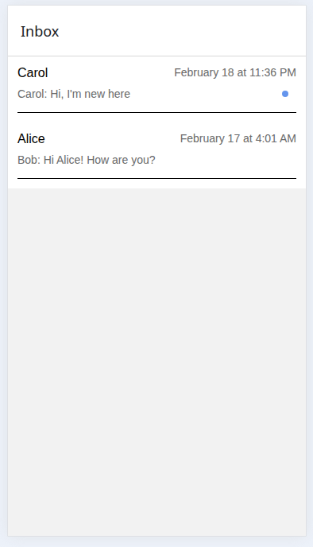

## Expo demo

This is a basic React Native app showing messaging functionality

### Functionality
- Loads messaging data from JSON into ParsedConvo and ParsedMessage types
- User moves through Inbox and Messaging screens built with React Navigation by selecting conversations in the inbox screen
- Conversations are marked read upon user opening them, and saved with React state
- Conversations in inbox screen and messages in messaging screen are sorted chronologically by message times

 